### Section 1: Foundation & Local Repository
## Task 1.1: Environment Setup & Configuration
1. Setup Git Bash/Terminal
2. Repository Creation

## Task 1.2: Basic File Operations
1. Create and commit files:
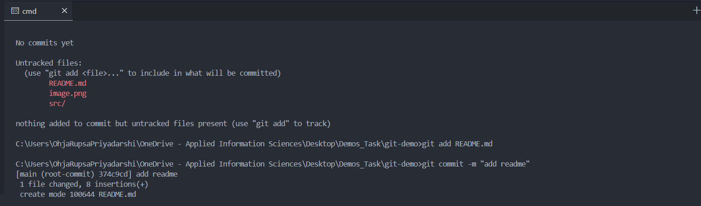

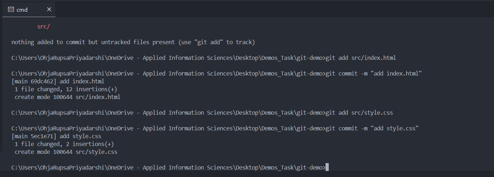

2. Practice staging
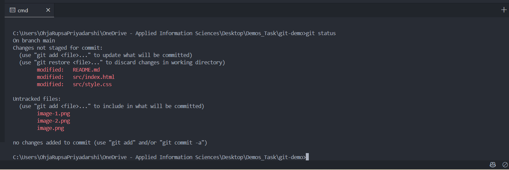

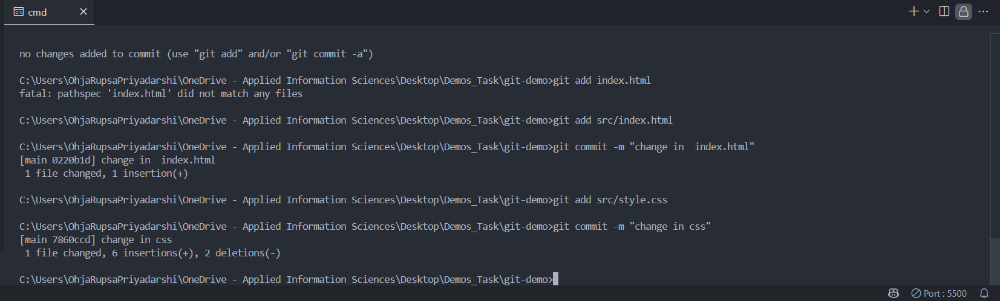

git diff - This command shows the difference between the working directory and the staging area.

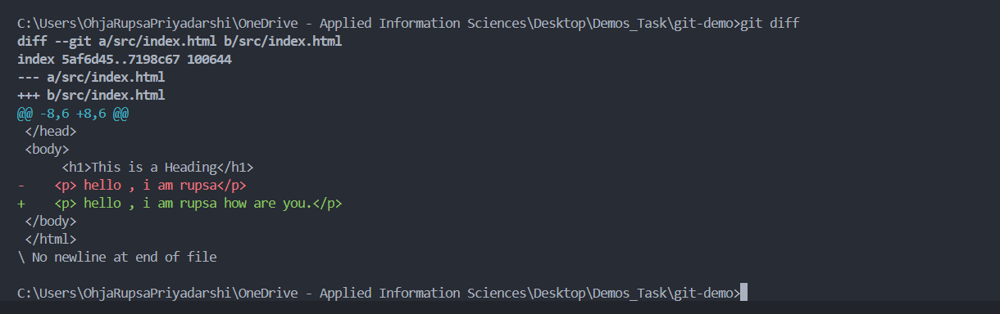

## Task 1.3: History and Undoing Changes

1. Explore Git history:

- git log --oneline
Shows a compact log with each commit in one line:

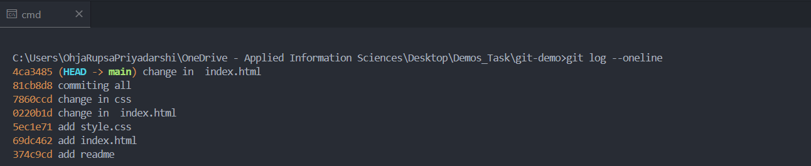

- git log --graph
Displays the branch and merge history as a graph:

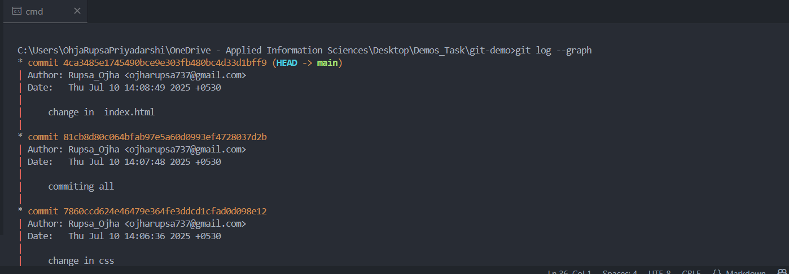

- git log --decorate
Adds branch/tag names to commits:

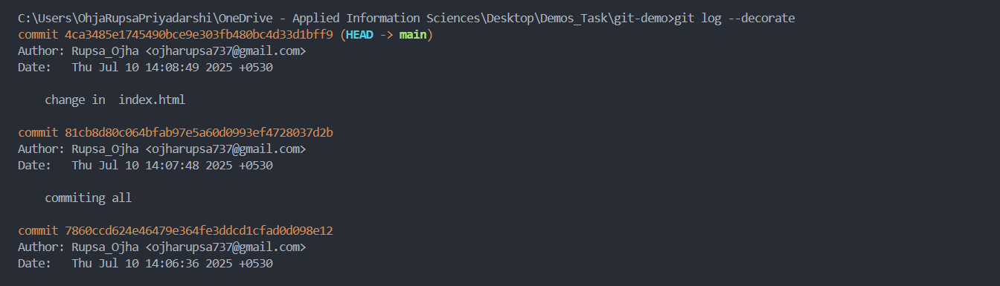

2. Practice undoing changes:
- Make a "bad" commit (add wrong content)
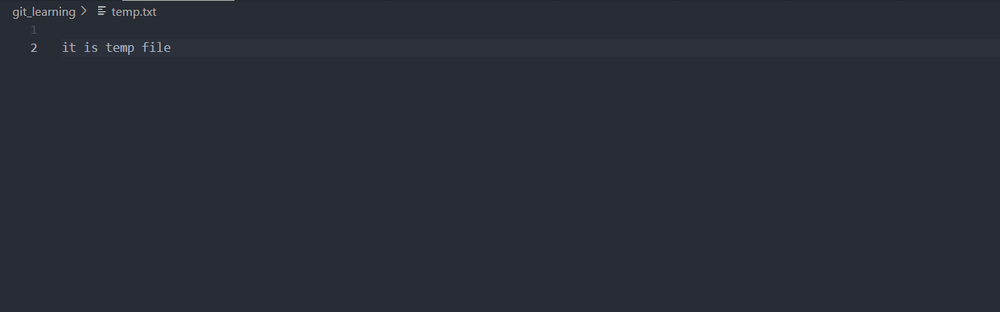

- Practice git revert to undo it
git revert <commit-hash>
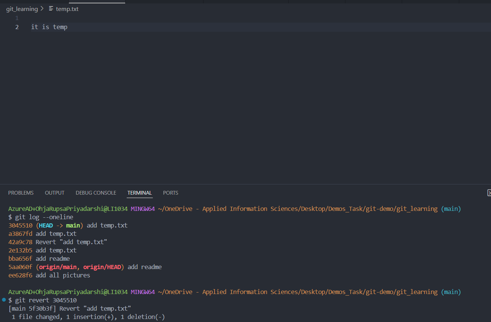

- Make another change and practice git reset
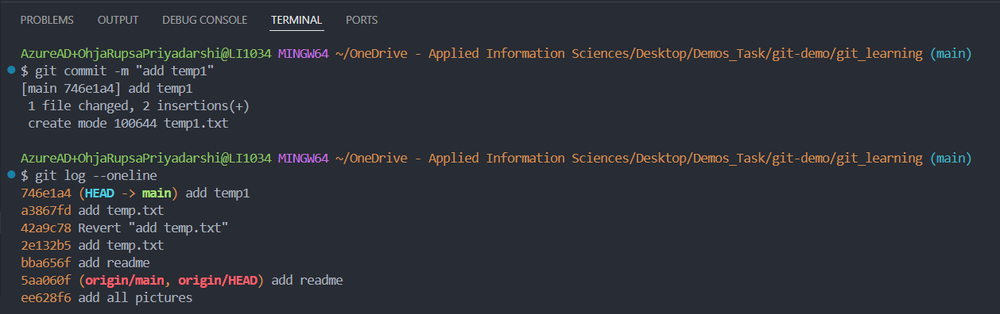

git reset --soft <hash>     : Uncommit, keep changes staged

git reset --mixed <hash>	: Uncommit, changes unstaged

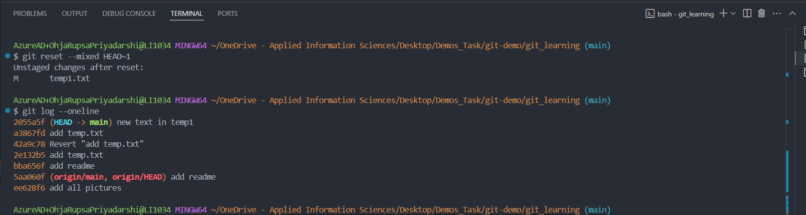

git reset --hard <hash>     : Uncommit and delete changes completely

- Document the differences between revert and reset
🔁 git revert                                              vs                                        git reset

Purpose	Undo a specific commit by creating a new commit	                   Move the current branch to a previous commit (and maybe remove changes)
History-safe?	✅ Yes (safe for shared/public repos)	                 ❌ No (can rewrite history — unsafe for shared branches)
Creates a new commit? ✅ Yes      	                                     ❌ No (unless used with --soft, then commit can follow)
Data loss risk?	❌ Low	                                                 ⚠️ High (with --hard, deletes changes permanently)
Common use :Undo changes without affecting commit history	               Rewind history or unstage/remove local commits
Best for :	Public/shared repositories	                                   Private/local branches or fixing recent mistakes

## Task 1.4: File Management
1. Gitignore:

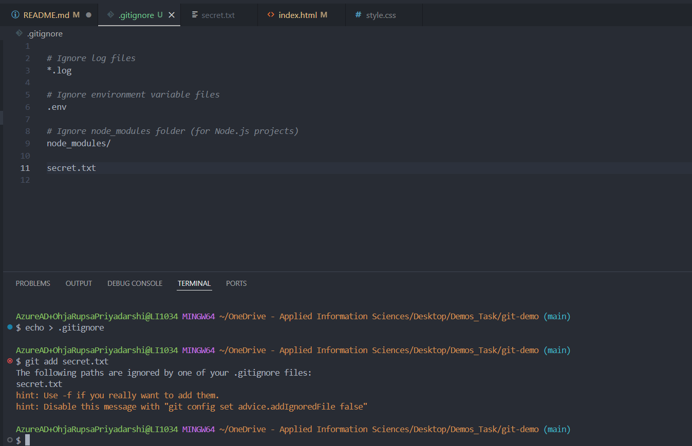

2. File removal:

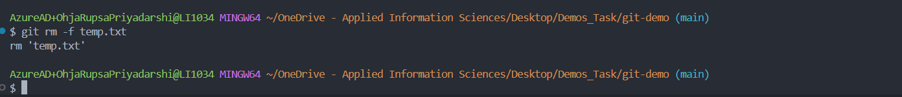

📄 Check out the [Git Cheat Sheet](GitCheatSheet.md)

### Section 2: Branching & Merging Mastery
## Task 2.1: Branch Creation & Management
1. Create feature branches:

