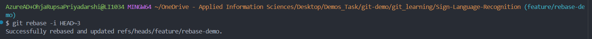
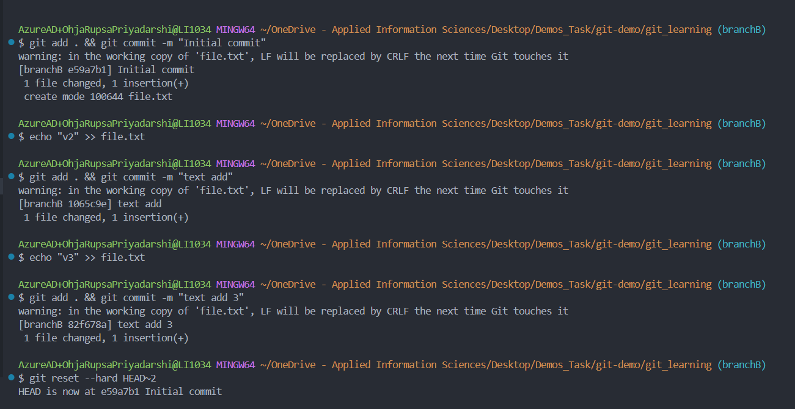
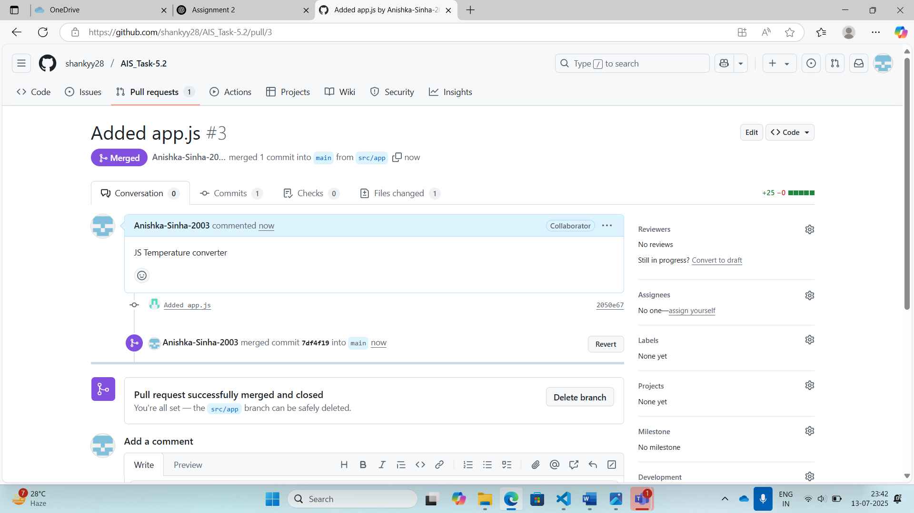

### Section 1: Foundation & Local Repository
## Task 1.1: Environment Setup & Configuration
1. Setup Git Bash/Terminal
2. Repository Creation

# Usage Levels of Configuration
Scope	    Command	Affects	Stored In
Local	    git config --local (default)	Only in the current repo	
Global	    git config --global          	All repos for this user	
System-wide	git config --system     	    All users on the system	

## Task 1.2: Basic File Operations
1. Create and commit files:

2. Practice staging

- git diff - This command shows the difference between the working directory and the staging area.

# Command Shows
git diff	Working directory ↔ Staging area
git diff --staged	Staging area ↔ Last commit
git diff HEAD	Working directory ↔ Last commit
git diff branch1..branch2	Differences between branches

## Task 1.3: History and Undoing Changes

1. Explore Git history:

- git log --oneline
Shows a compact log with each commit in one line:

- git log --graph
Displays the branch and merge history as a graph:

- git log --decorate
Adds branch/tag names to commits:

2. Practice undoing changes:
- Make a "bad" commit (add wrong content)

- Practice git revert to undo it
git revert <commit-hash>

- Make another change and practice git reset

git reset --soft <hash>     : Uncommit, keep changes staged

git reset --mixed <hash>	: Uncommit, changes unstaged

git reset --hard <hash>     : Uncommit and delete changes completely

- Document the differences between revert and reset
🔁 git revert                                              vs                                        git reset

Purpose	Undo a specific commit by creating a new commit	                   Move the current branch to a previous commit (and maybe remove changes)
History-safe?	✅ Yes (safe for shared/public repos)	                 ❌ No (can rewrite history — unsafe for shared branches)
Creates a new commit? ✅ Yes      	                                     ❌ No (unless used with --soft, then commit can follow)
Data loss risk?	❌ Low	                                                 ⚠️ High (with --hard, deletes changes permanently)
Common use :Undo changes without affecting commit history	               Rewind history or unstage/remove local commits
Best for :	Public/shared repositories	                                   Private/local branches or fixing recent mistakes

## Task 1.4: File Management
1. Gitignore: .gitignore is a plain text file that tells Git which files or folders to ignore — meaning:

They won’t be tracked
They won’t be committed
They won’t appear in git status

2. File removal:

### Section 2: Branching & Merging Mastery
## Task 2.1: Branch Creation & Management
1. Create feature branches:

2. Switch between branches and add different features
   Make at least 2 commits per branch

  Practice git branch -a to see all branches

 

## Task 2.2: Branching
1. Create branches from specific commits:
- Now create your new branch hotfix/urgent-fix from  that commit:
- Switch to the New Branch:

2. Branch naming conventions:
- Rename poorly named branches

- Practice deleting branches (both local and remote)

Steps:
- create a new branch and push to remote:

- Switch Back to Another Branch(You cannot delete a branch while you're on it.)

# Delete the Branch Locally
  git branch -d test/delete-demo

# Delete the Branch Remotely
  git push origin --delete test/delete-demo

## Task 2.3: Merging Strategies
1. Merges:
Merge feature/navigation into main

Observe the linear history

2. Three-way merges:
- Create conflicting changes in different branches
- Practice resolving merge conflicts manually
- Complete the merge with proper commit message

## Task 2.4: Merge Conflict Resolution
1. Intentional conflicts:
- Create two branches that modify the same lines
- Practice conflict resolution using:
- Command line tools

- VS Code merge editor

## Task 2.5: Challenge

### Section 3: Remote Repositories & GitHub Integration
## Task 3.1: GitHub Repository Setup

1. Create remote repository:
- Create git_learning repository on GitHub

2. Remote operations:
Practice git remote -v
Add multiple remotes (if you have access to another Git service)

Term	                          Meaning
origin	-   The default remote (your repo on GitHub, usually where you push)
upstream-	The original project (if you forked someone else's repo)

## Task 3.2: Cloning & Forking
1. Clone operations:

Practice working with both local copies
- pushing and pulling between two local clones of the same remote repo.

Understand how remote tracking works

2. Fork a public repository:

Fork an interesting open-source project

Clone your fork locally

push to your fork

## Task 3.3: Collaboration Simulation
1. Multi-device workflow:

- Work from your cloned repository

- Make changes and push

- Pull changes from the original repository

2. Fetch vs Pull:

- Practice git fetch operations

- Compare local and remote branches

 Or just: git pull origin master

You want to preview changes without merging	-git fetch
You're collaborating and need latest code -	git pull
You want more control over merge conflicts -git fetch + manual merge

Task 3.4: Pull Request Workflow
1. Create pull requests:

Create feature branches

Push to GitHub

Create pull requests with detailed descriptions

Practice self-review and merge

2. Pull Request Etiquette:
Best Practice	
✅ Use clear PR title & summary	- Descriptive like "Fix login bug"
✅ Add reviewers/assignees	- Right-side GitHub panel
✅ Keep PRs small & focused	One purpose per PR
✅ Add screenshots if UI changes	Upload in description

## Task 3.5: Challenge

Set up a "fake team collaboration":
Create a second GitHub account or use a friend's
Practice the full PR workflow with reviews
Document the collaboration process

## Task 4.1: Git Rebase
1. Interactive rebase:
Create a feature branch with multiple commits
Use git rebase -i to:
- Squash commits
- Reword commit messages
- Reorder commits
- Drop unnecessary commits

Action	What it Does
pick	Keep commit as is
reword	Edit the commit message
squash	Combine commit with previous one
drop	Remove the commit

2. Rebase vs Merge:
Create two identical feature branches
Merge one and rebase the other
Compare the resulting history

You must be on the branch you're rebasing to perform a rebase.

## Task 4.2: Git Aliases & Productivity
1. Create useful aliases:
git st for status
git co for checkout
git br for branch
git lg for pretty log format

## Task 5: Large Repository Management
1. Simulate large project:
Create multiple directories and files
Implement proper .gitignore for different file types

Practice selective staging with git add -p

2. Repository maintenance:
Use git gc for cleanup
Understand repository size and optimization
Practice git prune and git fsck

- git fsck - Checks internal Git object integrity — like a file system check (fsck) for a hard drive.

## Task 5.2: Team Collaboration Scenario

1. Multi-contributor simulation:
Create a complex project structure
Simulate multiple developers working on different features
Practice conflict resolution in team settings
Implement code review processes

2. Branch protection rules:
Set up branch protection on GitHub
Require pull request reviews
Implement status checks
Test the protection rules

- main -intial commit

 - pull request of css

 - merge conflict

### Troubleshooting & Problem Solving

## Task 6.1: Common Git Problems

1. Simulate and solve problems:
Detached HEAD state

Merge conflicts in binary files

Accidentally committed sensitive data

Lost commits recovery

Corrupted repository repair

Simulate corruption - rm -rf .git/objects/??/

Try backup - git fetch origin
git reset --hard origin/main

2. Troubleshooting:
- Use git reflog to recover lost work

git reflog - shows the history of movements of HEAD, meaning it tracks every place your branch pointer has been — including commits you may have deleted, reset, or lost.

- Practice git bisect for bug finding

git bisect uses binary search to find the commit that introduced a bug.

# Why It’s Powerful
Instead of checking 100 commits one by one, git bisect only needs ~log₂(N) steps (i.e., 7 steps for 128 commits).

- Understand git fsck for repository health

- git fsck = File System Check
  
  

## Task 6.2: Data Recovery & Forensics
1. Commit recovery:
Accidentally delete commits
Use reflog to recover
Practice hard reset recovery

2. File history analysis:

- Use git blame to track changes
- See Who Changed Each Line
- It helps track down which commit and author is responsible for each line in a file.

- Investigate file history with git log --follow

## Task 6.3: Security & Best Practices
1. Security considerations:
Practice removing sensitive data
Implement signed commits
Understand security implications of different workflows

Workflow	                                                               Risk (if unmanaged)	Best Practice
Commit directly to main	Bugs or secrets added without review	- Use pull requests + branch protection
Push forcefully	Deletes history, can remove security changes	- Only allow force-push on non-protected branches
Share repo publicly	Can leak secrets in history	                - Clean history + use .gitignore
Merge untrusted PRs	Can introduce malicious code	            - Always review, test & sign commits
Share .git folder Leaks full history, secrets, branches         - Never share .git/ – only use remote

### Day 7: Project & Assessment
## Task 7.1: Complete Demo project

### 1. Repository Initialization:
- A new GitHub repository named `AIS_Task5.2` was created.

### 2. Collaborators Added:
- Team members were added as collaborators via GitHub repository settings.
- Everyone cloned the repository locally and set up remotes.

---
### 3. Git Workflow Followed:

#### ✅ Step 1: Initial Push
- One person created the main repo and performed the **initial push** with a `README.md` and empty folders/files.
- Commit message: `Initial project setup with base files`

#### ✅ Step 2: Feature Development Using Branches
- Separate branches were created for each part of the project:
- `feature/html` → Created `index.html`
- `feature/css` → Added styles in `style.css`
- `feature/js` → Implemented logic in `app.js`

#### ✅ Step 3: Pull Request & Code Review
- Each person pushed their feature branch and created a **Pull Request (PR)** on GitHub.
- One PR had **merge conflicts** due to simultaneous edits on the same file.

---

### 4. 🧩 Merge Conflict Resolution:
- The conflict occurred in and the developer resolved the conflict.
- Final version was tested, and the PR was successfully merged into `main`.
- Commit message: `Resolved merge conflict in index.html and finalized structure`

---

## 📘 Git Commands Practiced:
- `git clone`
- `git checkout -b feature-name`
- `git add`, `git commit -m`
- `git push origin feature-name`
- `git pull origin main`
- `git merge main`
- `git status`, `git diff`
- `git remote -v`
- Pull request creation and code review

- main -intial commit

 - pull request of css

 - merge conflict

